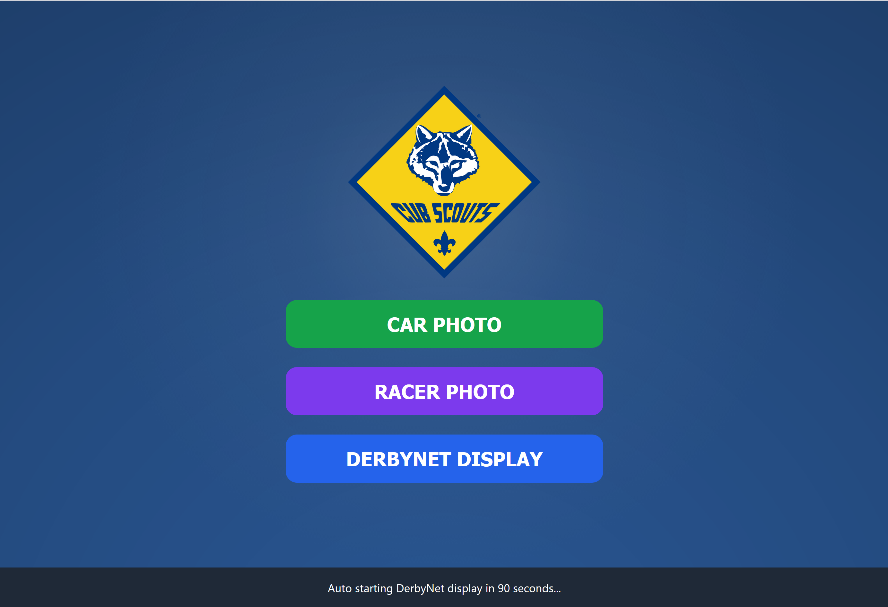
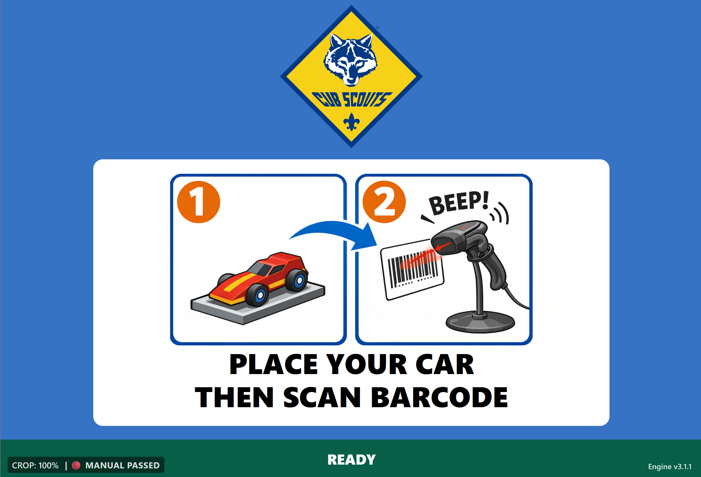
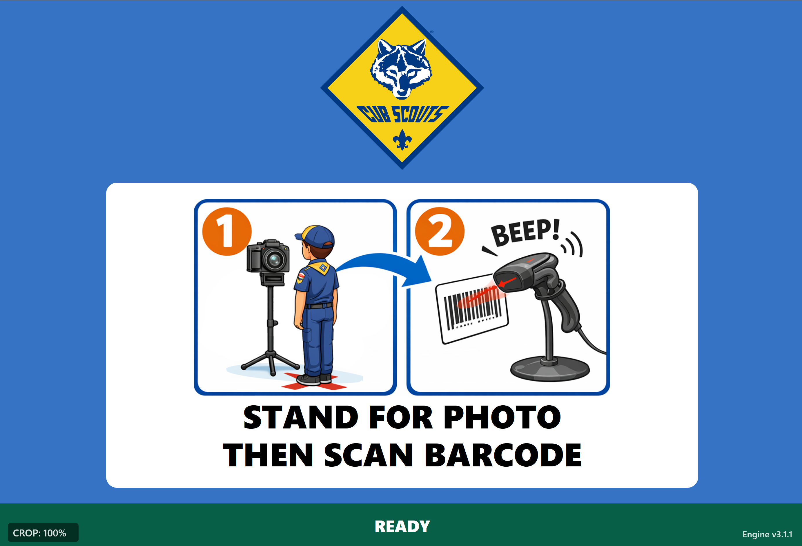
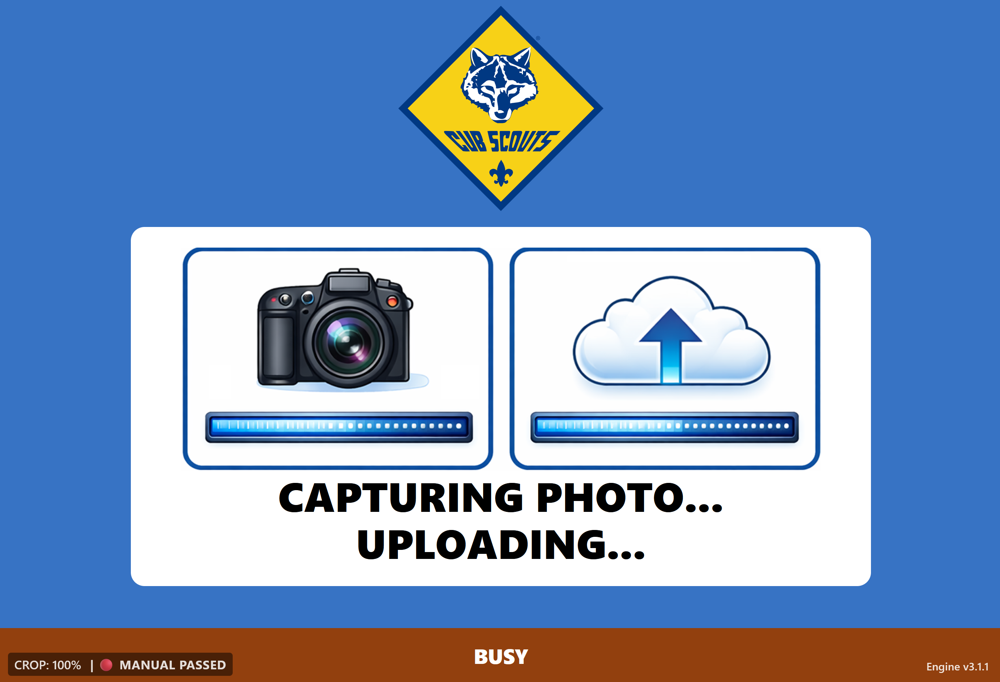
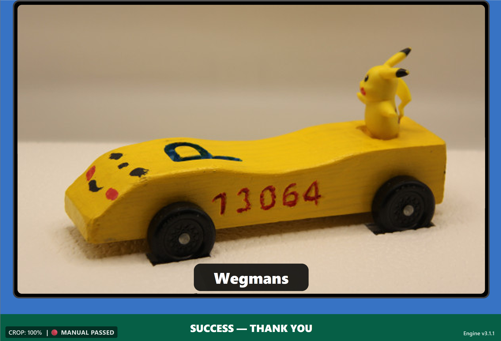
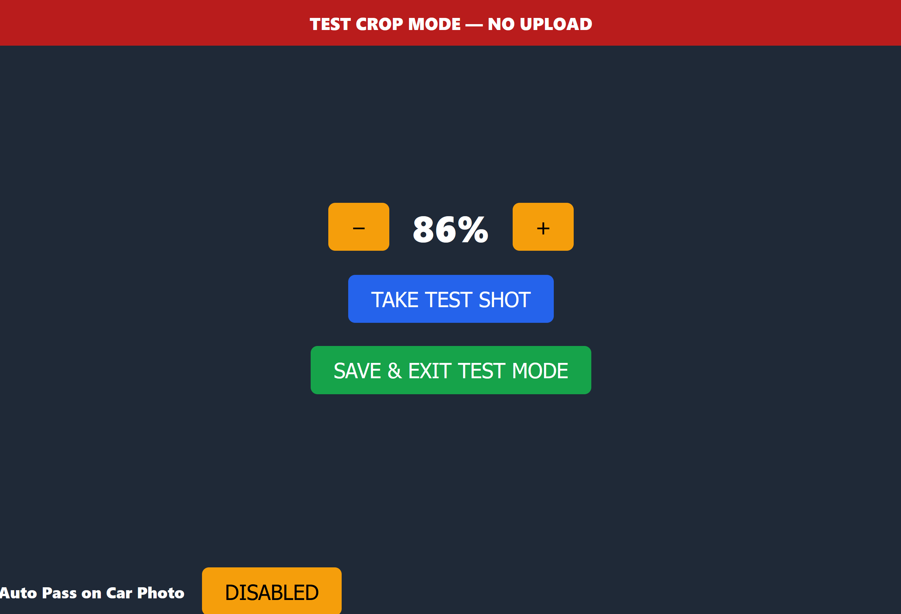

# DerbyNet Photo Kiosk

A Raspberry Pi–based photo kiosk for Pinewood Derby events that automatically captures and uploads **racer photos and car photos** into DerbyNet using a barcode scanner.

This project is a companion tool designed to work with the DerbyNet race management system:
https://github.com/jeffpiazza/derbynet

The system allows race staff to quickly photograph racers and cars without manual file handling. A barcode is scanned, the camera captures the image, the photo is automatically cropped, and the image is uploaded directly to DerbyNet.

Designed for simplicity, reliability, and low cost, the Photo Kiosk runs entirely on a Raspberry Pi and requires minimal operator interaction.

## Inspired By
This project was inspired by the DerbyNet barcode photo capture workflow demonstrated here:
https://www.youtube.com/watch?v=aR5vDUBemx4
The goal was to extend that workflow into a self-contained Raspberry Pi kiosk that can run independently at photo stations.

---

# Overview

The kiosk automates the process of capturing and uploading racer or car photos.

Typical workflow:

1. A racer arrives at the photo station.
2. Staff scans the racer's barcode from the check-in sheet or badge.
3. The kiosk confirms the scan.
4. A countdown begins (in racer/headshot mode).
5. The camera captures the photo.
6. The image is automatically cropped.
7. The photo is uploaded to DerbyNet.
8. The kiosk resets and waits for the next racer.

The entire process typically takes **10–20 seconds per racer**.

---

# Key Features

## Barcode-Driven Workflow

The kiosk listens to a USB barcode scanner that behaves like a keyboard. When a barcode is scanned the system automatically starts the photo workflow.

## Automatic Photo Capture

Supports both:

- USB webcams (`fswebcam`)
- DSLR cameras (`gphoto2`)

If a DSLR is connected it is used automatically. Otherwise the system falls back to a webcam.

## Automatic Cropping

Photos are automatically cropped based on a configurable percentage so the final image focuses on the racer or car.

## Direct DerbyNet Upload

Photos are uploaded directly to the DerbyNet API using a configured role account. No manual file transfers are required.

## Auto Pass Option

Optionally triggers DerbyNet to automatically mark a racer as **Passed** after the car photo is taken.

## Kid-Friendly Kiosk Mode

The kiosk runs full-screen Chromium in kiosk mode with a simple interface.

Optional countdown audio and sound effects help guide scouts during photo capture.

## Network Monitoring

If DerbyNet becomes unreachable the kiosk switches to a **network error screen** and automatically retries until connectivity returns.

---

# Hardware Requirements

Minimum recommended hardware:

- Raspberry Pi Compute Module 3+ (1GB RAM)  
- Raspberry Pi 4 or Raspberry Pi 5  
  *(primarily developed and tested on Compute Module 3+ & Raspberry Pi 5 both with 1GB RAM)*

- Raspberry Pi OS Desktop
- USB barcode scanner  
  *(tested with Symbol scanners and Onewscan USB 1D scanners)*
  *(https://www.amazon.com/dp/B0D4DG2VBX)  Onewscan produces more bad scans then symbol one we’ve found, even after limiting the input to only Code-128 on the scanner*

- Camera (one of the following):
  - USB webcam
  - DSLR camera supported by `gphoto2`

Tested cameras:

- Canon Rebel T2i DSLR
- Logitech Pro 9000 webcam

Required peripherals:

- HDMI display
- Keyboard (for setup)

Optional:

- Touch screen display
- USB speakers / HDMI audio
- LED lighting for better photos

---

# Software Stack

The kiosk relies entirely on standard Linux utilities:

- Apache
- PHP
- Python
- Chromium (kiosk browser)
- fswebcam
- gphoto2
- ImageMagick
- curl + jq

No proprietary software is required.

---

# How We Use the Kiosk

## Racer Headshot Night

We typically capture **racer headshots about a month before the derby**.

Workflow:

1. Enter racers into DerbyNet in advance.
2. Print check-in passes containing barcodes.
3. Scouts locate their pass.
4. A helper scans the barcode while the racer stands on a marked **X on the floor**.
5. After a successful upload the kiosk displays and announces the racer’s name.

Because some younger scouts cannot yet spell or write well, we have an older scout help **write the car name on the check-in tag**, which is entered into DerbyNet later.

---

## Car Photo Night (Inspection & Impound)

The night before Derby Day we perform:

- Final inspection
- Weigh-in
- Impound

After a car passes inspection it moves to the **Car Photo Station**.

Process:

1. The car is placed inside a **16×12×12 photo box**.
2. The box floor contains **wheel cutouts** so cars are always placed in the same location.
3. The barcode is scanned.
4. The kiosk captures and uploads the car photo.
5. After a successful upload the kiosk displays and announces the racer’s name. During car photo mode the system also announces the car name along with a randomly selected fun or inspirational racing phrase.

This ensures consistent car photos across all racers.

---

## Derby Day Display

On race day the same Raspberry Pi can be reused as a **DerbyNet display kiosk**.

After booting the Pi automatically redirects to the DerbyNet display page after ~90 seconds.

---

# Admin Controls

While in **Racer Mode** or **Car Mode**, an admin panel can be accessed.

**Triple-tap the event logo** to open the admin page.

Admin options include:

- Adjust crop percentage
- Enable or disable **Auto Pass**

Auto Pass is typically used during car photos because the car has already passed inspection.

---

# Barcode Control Mode

The system can be operated entirely using barcodes without touching the screen.

## Mode Selection Barcodes

At the startup screen scanning a barcode can trigger:

- Racer Mode
- Car Mode
- DerbyNet Display Mode
- Close Chrome

## Racer / Car Mode Barcodes

Additional barcodes allow administrators to:

- Set Racer Ready
- Set Racer Not Ready
- Close Chrome

---

# Deployment

The project includes an installer that can rebuild the entire kiosk on a fresh Raspberry Pi.

The installer automatically:

- Installs required packages
- Configures Apache
- Enables Chromium kiosk mode
- Configures autologin
- Deploys Photo Station files
- Sets correct permissions
- Configures audio output
- Installs the system service
- Tests camera, scanner, and network connectivity

A kiosk can be rebuilt in minutes before an event.

---

# What This Project Does NOT Do

To keep the system simple and reliable the Photo Station intentionally does **not** provide:

- A full photo management system
- Image editing tools
- Facial recognition
- Cloud storage
- Multi-camera switching
- Direct printing

All photo management is handled by DerbyNet.

---

# Why This Exists

Many Pinewood Derby events want racer photos in DerbyNet, but capturing them manually is slow and error-prone.

This kiosk makes photo capture:

- fast
- consistent
- kid-friendly
- inexpensive

The entire system runs on hardware that costs less than a typical race timer.

---

# Ideal Use Cases

- Pack-level Pinewood Derby events
- District Pinewood Derby events
- Check-in stations
- Car inspection stations
- Racer badge photos

---

# Project Goals

The goal of this project is to provide a simple, reliable, and inexpensive solution for Pinewood Derby photo capture that any pack can deploy.

We prioritize:

- reliability
- simplicity
- ease of deployment
- low hardware cost

---

## Real-World Use

This kiosk system was developed while preparing for our pack’s Pinewood Derby.
Although I am relatively new to Git and open-source development, the system
was successfully used to run what ended up being our most efficient and
smoothly run derby event so far.

Using DerbyNet together with this kiosk allowed us to quickly capture racer
and car photos with minimal effort during check-in and inspection. The process
reduced manual work for volunteers and kept the photo station moving smoothly.

While the project began as a solution for our own event, it was intentionally
designed to support a wide range of DerbyNet deployments. Many features were
built with the broader community in mind, including safeguards and error
handling to help the kiosk recover gracefully from common issues such as
network interruptions, camera failures, barcode scan errors, or DerbyNet
connectivity problems.

Many hours went into testing and debugging a wide range of scenarios that can
occur during Derby events. Where possible the kiosk includes checks and
recovery behavior so the system can continue operating with minimal volunteer
intervention.

Like any project, there is always room for improvement. The goal was to make
sure the core functionality was reliable and ready for real events while
keeping the system simple enough that other packs can deploy it easily.

Contributions and improvements are welcome.

---

# Contributions

Contributions are welcome.

Areas where improvements would be valuable include:

- UI improvements
- better camera support
- optional audio prompts
- improved installation tooling
- documentation for new users

## Screenshots

### Mode Selection

Choose between:
- Car Photo Mode
- Racer Photo Mode
- DerbyNet Display Mode

---

### Car Photo Mode

Place the car in the photo box and scan the racer's barcode to automatically capture and upload the car photo.

---

### Racer Photo Mode

Scouts stand on the floor marker while another scout scans their barcode to capture their headshot.

---

### Capture & Upload Process

The kiosk shows visual feedback while the photo is captured and uploaded to DerbyNet.

---

### Success Screen

After a successful upload the racer receives confirmation and a personalized message.

---

### Admin / Crop Test Mode

Administrators can adjust crop percentage and take test photos before the event.
